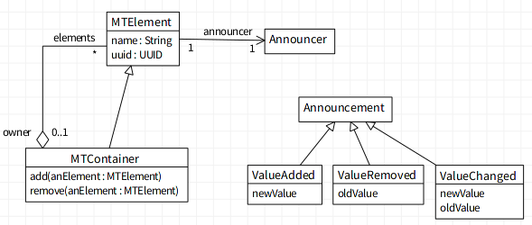

# MetaLinks Toolkit [](https://travis-ci.org/peteruhnak/metalinks-toolkit)

A toolkit simplifying the installation and reinstallation of MetaLinks.

MetaLinks themselves provide only very basic operations, e.g.:

```st
link uninstall.

link := MetaLink new
	metaObject: [ :object :selector :args |
		Transcript
			log: object className; log: '>>'; log: selector; logCr: args.
	];
	selector: #value:value:value:;
	arguments: #(object selector arguments);
	control: #before.

(MTElement>>#name:) ast link: link.

obj := MTElement new.
obj name: 'new name'.
```


the line above will execute the installed link, an in Transcript I will see

```MTElement>>name:#('new name')```

Now install the link to every method in the class, and every time you trigger a method recompile (method change, instance variable rename, ...), you can do the reinstallation all over again…

This toolkit does that automatically and much more.

## MTMetaLinksInstaller — persistent MetaLinks

Class `MTMetaLinksInstaller` provides an API for permanently installing metalinks to a class. As the AST of a methods can very drastically between changes, this API does not permit installation to arbitrary nodes.

Instead we recognize two primary targets:
* selector (method)
* attribute (instance variable)

### Installing to a selector

Targetting a selector will always keep the MetaLink installed. You also maintain the control of the metalink itself.

```st
link := MetaLink new. "setup as previously as you require"

installer := MTMetaLinksInstaller new.
installer installPermanent: metaLink toMethod: #name: of: MTElement.
```

Even if you remove the method and then add it again, the metalink will add itself back. Instead you get rid of it via the installer.

```st
installer uninstallMethod: #name: of: MTElement.
```

or more aggresively (removing all permanent metalinks in th class including attribute ones)

```st
installer uninstallAllPermanentLinksIn: MTElement.
```
### Installing to an attribute

An attribute link will be added to all assignment nodes in the entire class **except** the `initialize` method. Similarly to a method, if you add a new assignment (or a new method with an assignment), it will be (re)added.

```st
installer installPermanent: metaLink toAttribute: #name of: MTElement.
```

and to uninstall

```st
installer uninstallAttribute: #name of: MTElement.
```

## MTMetaLinksChangeInstaller

The primary purpose of this is class is to ease the observation of changes in models without touching the code itself.



In the model above I would like to fire on the element's announcer:
* `ValueAdded` announcement every time an element is added to a container
* `ValueRemoved` announcement every time an element is removed from a container
* `ValueChanged` announcement every time an element's attribute has changed

The first two can be handled by *selector* permalinks and the last one by *attribute* permalink.

`MTMetaLinksChangeInstaller` aim is to encapsulate this.

```st
observations := {
	MTObservationSet
		target: MTElement
		change: #(name owner uuid)
		add: #()
		remove: #().

	MTObservationSet
		target: MTContainer
		change: #()
		add: #(add:)
		remove: #(remove:)
}.
ci := MTMetaLinksChangeInstaller new.
ci install: observations.
element := MTElement new.
container := MTContainer new.

"Now we can use normal Announcement propagation"
element when: ValueChanged do: [ :oldValue :newValue | ... ].
container when: ValueAdded do: [:newValue | ... ].
container when: valueRemoved do: [:newValue | ... ].
```

The default behavior of the class is to fire the announcement, more specifically

```st
changeMetaObjectBlock := [ :object :newValue |
	object announcer announce: (ValueChanged newValue: newValue)
].
```

Naturally this behavior can be customized

```st
"A block [ :object :newValue | ],
where `object` is the observed object, and `newValue` the newly assigned value."
ci changeMetaObjectBlock: [ :object :newValue | ... ]
```

### MTMetaLinksInference

Final tool in the toolkit is an automatic inferencer. This will scan through the source code of the provided methods and will guess what places should be observed.

The result will be a dictionary of `MTObservationSet` as was seen in previous section.
```st
MTMetaLinksInference new inferClasses: { MTElement . MTContainer }
 "a Dictionary(MTContainer->a MTObservationSet(
	#change -> #(#elements).
	#add -> #(#add:).
	#remove -> #(#remove:)
) MTElement->a MTObservationSet(
	#change -> #(#name #owner #uuid).
	#add -> #().
	#remove -> #()
) )"
```

